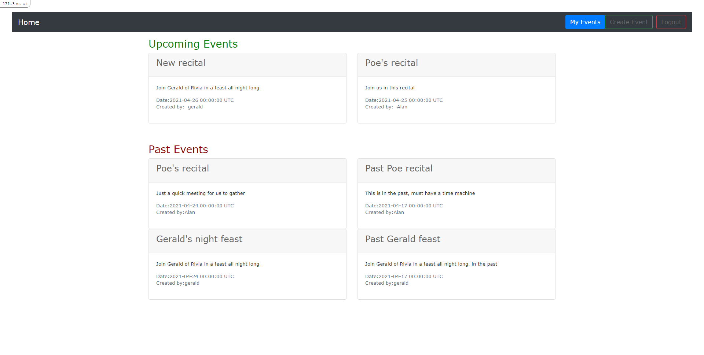

# Project: Associations

This project provides a understanding of the methods used to create associations on rails

# Screenshot

- Main Index View


# Built With

- Ruby on Rails

# Prerequisites

- Ruby 3.0.
- Rails 6.1.3
- SQLite3
- Node.js
- Yarn
- Rspec

# Getting Started

- Run this command in your OS terminal: `git clone https://github.com/notrexxx/Private-events.git` to get a copy of the project. 

# Usage
To run the application please:

- Start a new Terminal 
- Go to the directory where you cloned the Re-form repository
- Type:
```
bundle install
```
Press ENTER and wait.

- Type:
```
 rails db:create
```
and press ENTER
- Type:
```
 rails db:migrate
```
and press ENTER
- Type:
```
yarn install
```
and press ENTER
- Type:
```
 rails server
```
and press ENTER

# Use the application

- Go to http://127.0.0.1:3000/

- Sign In users by using the sign in form
- Create posts events by navigating to 'Create event'
- You can see the events only if you are logged in

# Tests

- Start a new Terminal 
- Go to the directory where you cloned the repository
- Type:
```
rspec
```
and press ENTER

# Author

👤 **Andres Leon**

- GitHub: [@notrexxx](https://github.com/notrexxx)
- Twitter: [@emigdioleon1](https://twitter.com/emigdioleon1)
- LinkedIn: [Emigdio Leon](https://linkedin.com/emigdio-leon-689109195)

# Show your support

Give a ⭐️ if you like this project!

# Contributing

Contributions, issues, and feature requests are welcome!

Feel free to check the [issues page](https://github.com/notrexxx/Private-events/issues).

# Acknowledgments

- [Microverse](https://microverse.org)

# 📝 License

This project is [MIT](./LICENSE) licensed.
